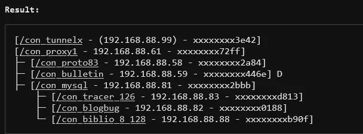
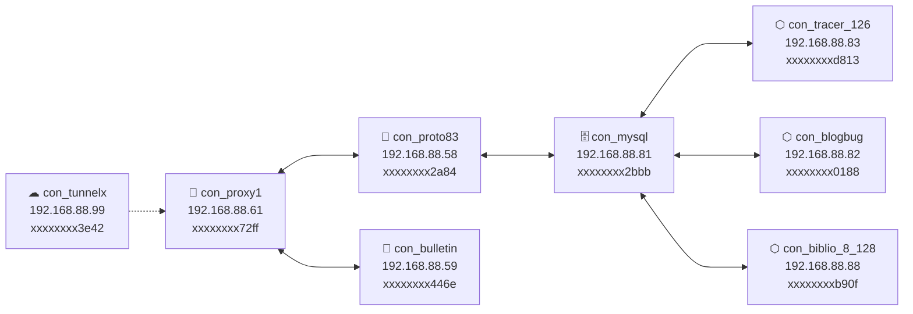
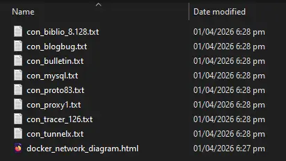
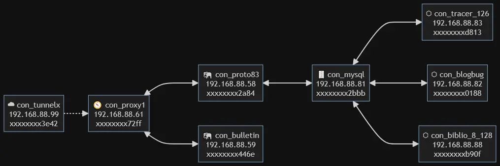

# DockerJelly ଳ

**DockerJelly** is a visual + ASCII Docker network notebook generator for humans.

It helps you map **container relationships**, **document intent**, and **generate Mermaid flowcharts** without parsing Docker internals or touching the Docker socket.

Think of it as a living **ops notebook** for your containers

> *Let’s keep those Docker ideas smooth and organized.*

---

## 🌱 Why DockerJelly Exists

Docker is powerful — but power without clarity creates friction.

Most Docker tools focus on execution: building, running, deploying.
DockerJelly focuses on **understanding**.

It exists because real-world Docker setups are often:

- Evolved over time
- Maintained by different people
- Remembered “in someone’s head”

**DockerJelly** turns that invisible knowledge into something **visible, lightweight, and human-readable**.

- Not another orchestrator.
- Not a replacement for Docker Compose or Kubernetes.
- Just a calm space to think, document, and reason about your containers.

Because **good infrastructure** starts with a **clear mental model**.

---

## ✨ What problem does DockerJelly solve?

Docker setups don’t fail because of commands —  
they fail because **mental models drift**.

DockerJelly gives you:
- 🧠 mental clarity
- 🗺️ visual relationships
- 📝 per-container notes
- 🧩 a lightweight, rule-based structure

Perfect for:
- Homelabs
- Small teams
- Schools
- Legacy + modern Docker setups

---

## 🚀 Features

- ASCII tree network diagram
- Mermaid flowchart generation
- Mermaid rendered directly in-browser
- Per-container `.txt` documentation pages
- No Docker socket access required
- Works from a simple shell script output

---

## 🧪 How to use
1. Copy the show_ip.sh on your docker host (home directory).
```console
chmod +x show_ip.sh
./show_ip.sh
```
- *This prints container names, IP addresses, and hostnames.*

2. Create your network file
```console
./show_ip.sh
```
3. Copy the output of ./show_ip.sh
4. Paste it into a text file, Save it as: mynetwork.txt

5. At the end of each line, append one rule that describes the container’s role:

| **Rules**             | **Description**           |
| ---------------------- | -------------------------------- |
| **tunn**     | Tunnel or external entry point (Cloudflare, ngrok, zrok, etc.)      |
| **prxy**     | Internal reverse proxy (Nginx, Traefik, Apache)      |
| **top1** | Use this as root container ONLY if you don't have tunnel (Proxy only setup) |
| **app+con_xxx**     | Child of prxy (or top1), where your app lives      |
| **data+con_a+con_b..**          | Database serving specific app containers, append app containers using (+) symbol *no spaces*|
| **side+con_db**     | Standalone / failsafe container using the Database |

6. Upload mynetwork.txt to **DockerJelly** and generate:
### 👉 ASCII diagram


### 👉 Text Generated Mermaid flowchart:
*The basic text-based mermaid flowchart can be copy/pasted on the https://mermaid.live to make adjustment*
```html
flowchart LR
A[☁︎ con_tunnelx<br>192.168.88.99<br>xxxxxxxx3e42]
A -.-> B[🧭 con_proxy1<br>192.168.88.61<br>xxxxxxxx72ff]
B <---> C[🐘 con_proto83<br>192.168.88.58<br>xxxxxxxx2a84]
B <---> D[🐘 con_bulletin<br>192.168.88.59<br>xxxxxxxx446e]
C <---> E[🗄️ con_mysql<br>192.168.88.81<br>xxxxxxxx2bbb]
E <---> F[⬡︎ con_tracer_126<br>192.168.88.83<br>xxxxxxxxd813]
E <---> G[⬡︎ con_blogbug<br>192.168.88.82<br>xxxxxxxx0188]
E <---> H[⬡︎ con_biblio_8_128<br>192.168.88.88<br>xxxxxxxxb90f]
```

*Rendered network diagram from mermaid.live:*


	
### 👉 Per-container note links


- *The 'Save as HTML' button allows you to save a copy of the generated diagram.*

- *Add these txt files manually, use filename based on each hyperlink.*

- *Updates, docker images, .conf/.cnf/.sh, Dockerfile, bind+volume mounts..etc for each container.txt is possible, easy access by the links in html file*

> Understanding + Documentation → Confidence

## 🧪 Lets practice, using our sample network:


*<small>The sample network diagram is generated using dockerjelly/mermaid.js</small>*

1. Our ./show_ip.sh would look like this:
	```bash
	/con_tunnelx - IP: 192.168.88.99 - Hostname: xxxxxxxx3e42
	/con_proxy1 - IP: 192.168.88.61 - Hostname: xxxxxxxx72ff
	/con_tracer_126 - IP: 192.168.88.83 - Hostname: xxxxxxxxd813
	/con_proto83 - IP: 192.168.88.58 - Hostname: xxxxxxxx2a84
	/con_bulletin - IP: 192.168.88.59 - Hostname: xxxxxxxx446e
	/con_blogbug - IP: 192.168.88.82 - Hostname: xxxxxxxx0188
	/con_biblio_8_128 - IP: 192.168.88.88 - Hostname: xxxxxxxxb90f
	/con_mysql - IP: 192.168.88.81 - Hostname: xxxxxxxx2bbb

2. From our network diagram above, we know: 

	a. con_nginx_sl is the reverse proxy
	→ *Append **top1** *

	b. con_proto83 and con_bulletin83 are children of the proxy con_nginx_s1
	→ *We reference these with 'con_nginx_sl'*

	c. con_bulletin83 is a stateless
	→ *No database dependency*

	d. con_proto83 requires database access
	→ *Include in the database rule*

	e. con_mysqldb is the database container
	→ *Declared using data+con_proto83*

	f. con_blogbug, con_biblio_8_128, and con_stray_126:
	- *Use the same database*
	- *Operate independently*
	- *Use a different tunnel / proxy*
	- *Declared using side+con_mysqldb*
	
8. Final mynetwork.txt, ready to upload to DockerJelly:
	```bash
	/con_tunnelx - IP: 192.168.88.99 - Hostname: xxxxxxxx3e42 - tunn
	/con_proxy1 - IP: 192.168.88.61 - Hostname: xxxxxxxx72ff - prxy
	/con_tracer_126 - IP: 192.168.88.83 - Hostname: xxxxxxxxd813 - side+con_mysql
	/con_proto83 - IP: 192.168.88.58 - Hostname: xxxxxxxx2a84 - app+con_proxy1
	/con_bulletin - IP: 192.168.88.59 - Hostname: xxxxxxxx446e - app+con_proxy1
	/con_blogbug - IP: 192.168.88.82 - Hostname: xxxxxxxx0188 - side+con_mysql
	/con_biblio_8_128 - IP: 192.168.88.88 - Hostname: xxxxxxxxb90f - side+con_mysql
	/con_mysql - IP: 192.168.88.81 - Hostname: xxxxxxxx2bbb - data+con_proto83
	
### 📝 Notes on naming

- The con_ prefix is recommended, not required
- DockerJelly works fine without it
- The prefix simply improves readability and consistency

### 🚀 Requirements and how to install:

- PHP 7.4+ (PHP 8.x supported) 
- Web server (Apache / Nginx / PHP built-in server)
- Docker host (optional, for show_ip.sh)

### Install

- Copy index.php into your web root (e.g. www/, htdocs/, or /var/www/html)

- Or place it in a folder:
	```bash
	www/dockerjelly/
Then open:
```console
http://localhost/dockerjelly/
```
## ✔ Scope & limitations

### ✔ This tool assumes:

- One primary ingress (top1)
- DB dependencies are declared via data+container
- Containers without explicit DB linkage are detached

### ❌ This tool does NOT yet model:

- Multiple databases
- Cross-container non-DB dependencies
- Message queues, caches, or internal service meshes
- Network-level segmentation (macvlan vs bridge is abstracted)

## 🙏 Credits
Mermaid.js — for the incredible diagram engine (MIT License)

https://mermaid.js.org/

https://github.com/mermaid-js/mermaid

## 📄 License

MIT License

Copyright © 2025 Ferdinand Tumulak