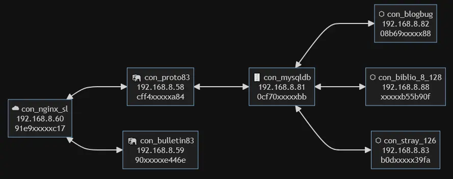

# DockerJelly ଳ

**DockerJelly** is a visual + ASCII Docker network notebook generator for humans.

It helps you map container relationships, document intent, and generate
Mermaid flowcharts — without parsing Docker internals or touching the Docker socket.

i.e. This tool will help you properly document your containers (Dockerfile, conf, sh, etc..)

> *Let’s keep those Docker ideas smooth and organized.*

---

## ✨ What problem does DockerJelly solve?

Docker setups don’t fail because of commands —  
they fail because **mental models drift**.

DockerJelly gives you:
- 🧠 mental clarity
- 🗺️ visual relationships
- 📝 per-container notes
- 🧩 a lightweight, rule-based structure

Perfect for:
- Homelabs
- Small teams
- Schools
- Legacy + modern Docker setups

---

## 🚀 Features

- ASCII tree network diagram
- Mermaid flowchart generation
- Mermaid rendered directly in-browser
- Per-container `.txt` documentation pages
- No Docker socket access required
- Works from a simple shell script output

---

## 🧪 How to use
1. Copy the show_ip.sh on your docker host (home directory).
```console
chmod +x show_ip.sh
./show_ip.sh
```
2. Generate container IP + details using ./show_ip.sh:
```console
./show_ip.sh
```
4. Copy / Paste the generated info. Save as: mynetwork.txt
5. Append relationship rules at the end of each line (mynetwork.txt):

| **Rules**             | **Description**           |
| ---------------------- | -------------------------------- |
| **top1** | root container (nginx/apache) |
| **con_xxx**     | child of root      |
| **data+con_a+con_b**          | database serving those apps |
| **side+con_db**     | failsafe container independent of root |

6. Upload file to **DockerJelly**

## 🧪 Lets practice, using our example network:


1. Our ./show_ip.sh would look like this:
	```bash
	/con_proto83 - IP: 192.168.8.58 - Hostname: cff4xxxxxa84
	/con_bulletin83 - IP: 192.168.8.59 - Hostname: 90xxxxxe446e
	/con_nginx_sl - IP: 192.168.8.60 - Hostname: 91e9xxxxxc17
	/con_blogbug - IP: 192.168.8.82 - Hostname: 08b69xxxxx88
	/con_biblio_8_128 - IP: 192.168.8.88 - Hostname: xxxxxb55b90f
	/con_stray_126 - IP: 192.168.8.83 - Hostname: b0dxxxxx39fa
	/con_mysqldb - IP: 192.168.8.81 - Hostname: 0cf70xxxxxbb

2. From our network diagram, we know: 

	a. con_nginx_sl is the reverse proxy
	→ *We append the keyword 'top1'*

	b. con_proto83 and con_bulletin83 are children of the proxy con_nginx_s1
	→ *We reference these with 'con_nginx_sl'*

	c. con_bulletin83 is a stateless (doesn't require a db)
	→ *We don't include it in our db*

	d. con_proto83 requires database access
	→ *We include this in our db*

	e. con_mysqldb is the database container
	→ *Declared using data+con_proto83*

	f. con_blogbug, con_biblio_8_128, and con_stray_126:
	- *Use the same database*
	- *Operate independently*
	- *Use a different tunnel / proxy*
	- *Declared using side+con_mysqldb*
	
8. The processed mynetwork.txt should end up like below, ready to upload to DockerJelly:
	```bash
	/con_proto83 - IP: 192.168.8.58 - Hostname: cff4xxxxxa84 - con_nginx_sl
	/con_bulletin83 - IP: 192.168.8.59 - Hostname: 90xxxxxe446e - con_nginx_sl
	/con_nginx_sl - IP: 192.168.8.60 - Hostname: 91e9xxxxxc17 - top1
	/con_blogbug - IP: 192.168.8.82 - Hostname: 08b69xxxxx88 - side+con_mysqldb
	/con_biblio_8_128 - IP: 192.168.8.88 - Hostname: xxxxxb55b90f - side+con_mysqldb
	/con_stray_126 - IP: 192.168.8.83 - Hostname: b0dxxxxx39fa - side+con_mysqldb
	/con_mysqldb - IP: 192.168.8.81 - Hostname: 0cf70xxxxxbb - data+con_proto83
	
### 📝 Notes on naming

- The prefix 'con_' is only for readability and consistency, DockerJelly works fine even without the 'con_' prefix.

## 🚀 Requirements

- PHP 7.4+ (PHP 8.x supported)
- Web server (Apache / Nginx / PHP built-in server)
- Docker host (optional, for show_ip.sh)

## Scope & limitations (good to document on GitHub)

### This tool assumes:

- One primary ingress (top1)
- DB dependencies are declared via data+container
- Containers without explicit DB linkage are assumed detached

### This tool does NOT yet model:

- Multiple databases
- Cross-container non-DB dependencies
- Message queues, caches, or internal service meshes
- Network-level segmentation (macvlan vs bridge is abstracted)

....to be continued